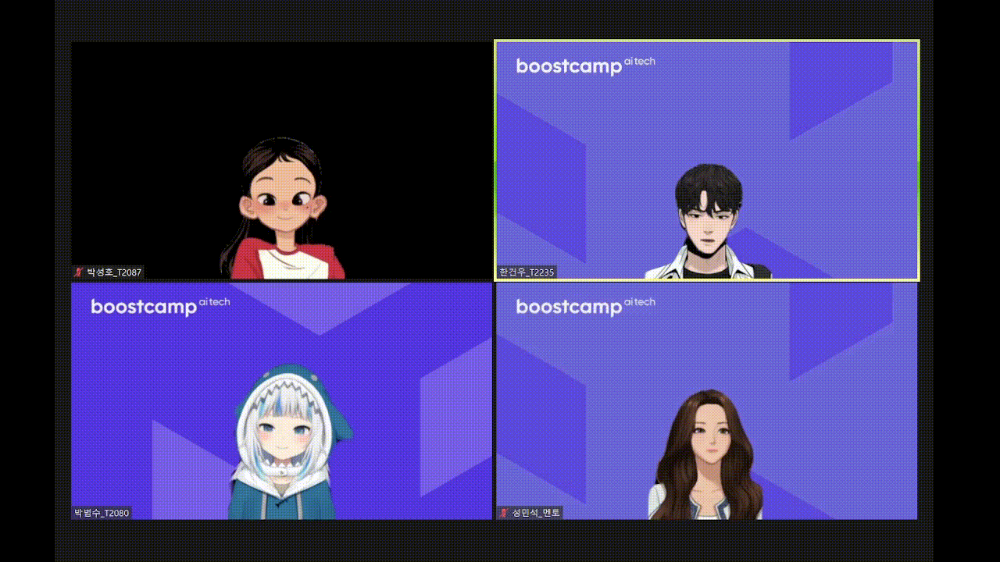
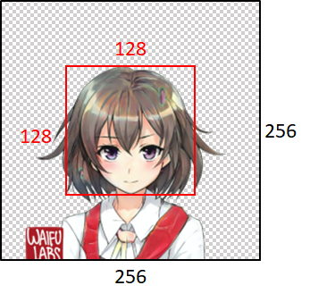
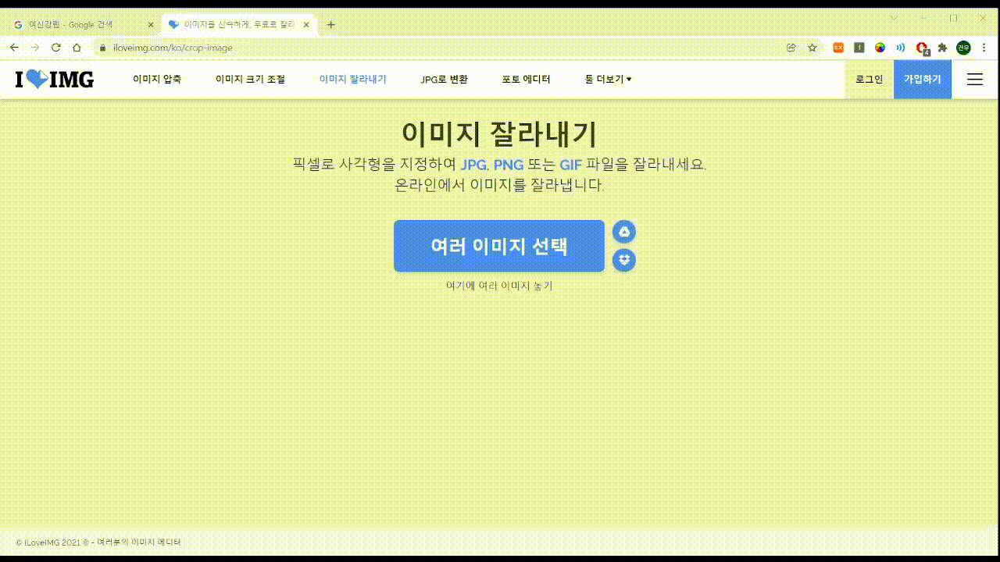

# EasyVtuber
Language: 
**`简体中文`** 
[`한국어`](https://github.com/GunwooHan/EasyVtuber/blob/main/README.md)
[`English`](https://github.com/GunwooHan/EasyVtuber/blob/main/README_EN.md)

## 介绍


- 使用Facial landmark和基于GAN的Character Face Generation
- 在Google Meets、Zoom等网站上用自己的虚拟角色对话！
- 饰品添加到什么程度都很好用！
- 遗憾的是，在RTX2070以下的情况下，可能无法实时正常工作。

<br/><br/>

## 测试图例



<br/><br/>

## 依赖
- Python >= 3.8 
- Pytorch >= 1.7 
- pyvirtualcam
- mediapipe
- opencv-python

<br/><br/>

## 快速开始
- ※该项目使用前必须安装OBS
- 请一定要遵守下面的安装顺序

1. [OBS Studio](<https://obsproject.com/ko>)
   - 必须先安装OBS Studio才能使用OBS Virtualcam
2. ```pip install -r requirements.txt```
   - 必须安装OBS virtual cam,requirements中包含的pyvirtual cam才能正常安装和使用
3. [预训练模型下载](<https://www.dropbox.com/s/tsl04y5wvg73ij4/talking-head-anime-2-model.zip?dl=0>)
   - 请将以下文件放入pretrained(预训练文件夹内)
     - `combiner.pt`
     - `eyebrow_decomposer.pt`
     - `eyebrow_morphing_combiner.pt`
     - `face_morpher.pt`
     - `two_algo_face_rotator.pt`
4. 请将角色图片放入角色文件夹中
   - character image文件必须满足以下条件：
     - 包括alpha通道（png扩展名）
     - 1个人形角色-角色将看到正面
     - 角色的头部将在128 x 128 像素内（默认情况下，大小为256 x 256，因此必须在256 x 256到128 x 128内）
    <p align="center">
        
    </p>

5.`python main.py --webcam_output`
   - 如果你想看看实际的facial feature是如何捕获的，请添加--debug选项运行它。

<br/><br/>
## 如何获取自定义的角色
1. 在NAVER、谷歌等搜索自己喜欢的角色！
   - 请尽量满足以上4个条件！

<br/><br/>

2. 在找到的图片中，为了让角色的脸保持在中心位置，请以横竖1:1的比例剪掉图片！
   - [图像剪切站点](https://iloveimg.com/ko/crop-image)  不是广告X

<br/><br/>
3. 去除图像背景，建立alpha频道！
   - [背景去除站点](https://remove.bg/ko)  不是广告X

<br/><br/>
4. 完成！
   - 将图像放入character folder并运行`python main.py --output_webcam --character（.png除外的角色文件名称）`
<br/><br/>

## 文件结构

```
      │
      ├── character/ - character images (角色图片)
      ├── pretrained/ - save pretrained models (预训练模型)
      ├── tha2/ - Talking Head Anime2 Library source files (有关Talking Head Anime2)
      ├── facial_points.py - facial feature point constants(有关面部特征点)
      ├── main.py - main script to excute(主文件)
      ├── models.py - GAN models defined(有关gan模型)
      ├── pose.py - process facial landmark to pose vector(处理面部部分)
      └── utils.py - util fuctions for pre/postprocessing image(其它函数)
```

<br/><br/>

## 使用
### 推送到webcam
- `python main.py --output_webcam`
### 指定角色
- `python main.py  --character(character folder中除.png以外的角色文件名)`
### 检查facial feature时
- `python main.py --debug`
<br/><br/>
### 视频文件
- `python main.py--input 视频文件路径 --output_dir frame要保存的目录`

## 计划
- [ ] 添加眉毛特征 
- [ ] 可视化面板 
- [ ] 可用的自动角色生成 

<br/><br/>

## 感谢
- 感谢允许使用`이루다`形象的 [Scater Lab 이루다 团队](https://scatterlab.co.kr), 允许使用`똘순이 MK1`图像的 [순수한 불순물](https://pixiv.net/users/21097691) 老师,感谢到深夜为止为制作README测试而帮助的成珉锡导师、朴成浩、朴范洙camper和提供项目方向性建议的金宝灿导师！
<br/><br/>

## 致谢
- EasyVtuber使用的[Talking HeadAnime2](https://github.com/pkhungurn/talking-head-anime-2-demo)
- tha2folder中的source和pretrained model file请查看和使用原始作者repo中的Liscense
